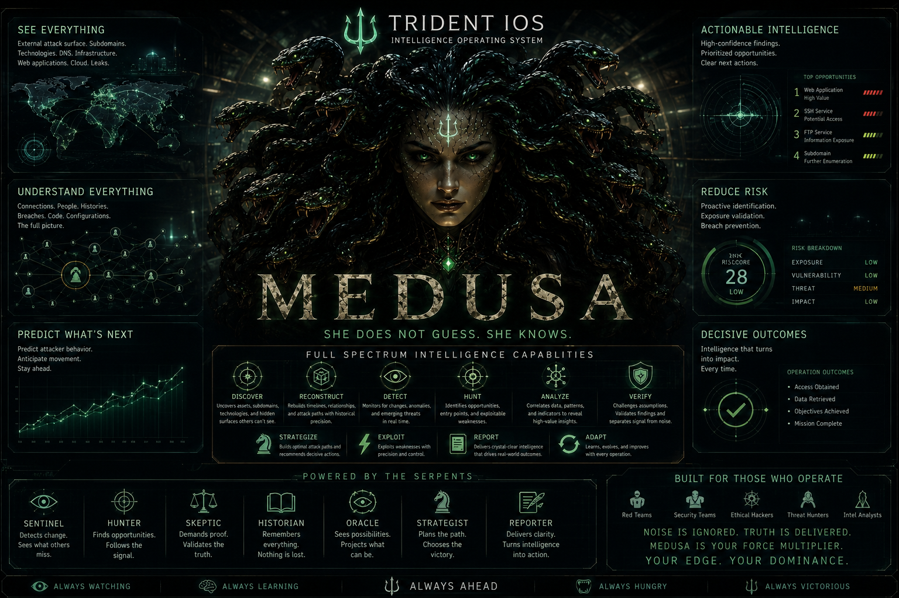

<p align="center">



</p>

# 🔱 Trident IOS


### **An Intelligence Operating System for Cybersecurity**

> **The Observer commands. Medusa coordinates. The Council reasons. The Serpents explore. The Loom remembers.**

---

## Origins

Trident IOS began life as an experimental fork inspired by the architecture and ideas explored in the Claude OSINT project.

That project helped spark the initial direction and demonstrated how an intelligence-first workflow could be organized.

As development progressed, Trident evolved into its own platform with a different architecture, philosophy, and long-term vision centered around the concept of an **Intelligence Operating System**.

We gratefully acknowledge that early inspiration while continuing to build Trident as its own independent project.

---

# Designed by

# **Prevail**

*"Signals fade. Patterns persist."*

---

# What is Trident?

Traditional cybersecurity tools answer one question.

> **"What did I find?"**

Trident answers another.

> **"What does it mean?"**

Trident transforms raw security tool output into persistent intelligence.

Every scan becomes structured observations.

Every observation strengthens shared knowledge.

Every mission builds upon every mission before it.

Instead of producing isolated reports, Trident builds an evolving understanding of the environments it investigates.

It is not another scanner.

It is not another SIEM.

It is not another chatbot.

It is an **Intelligence Operating System.**

---

# Architecture

```
                         👤 OBSERVER
                    Human Mission Commander
                               │
                               ▼
                        🐍 MEDUSA
                 Chief of Operations
                               │
        ┌──────────────────────┼──────────────────────┐
        │                      │                      │
        ▼                      ▼                      ▼
   🔱 Intelligence        🐍 Serpents           🕸 The Loom
      Council          Reconnaissance         Knowledge Graph
        │                      │                      ▲
        └──────────────┬───────┘                      │
                       ▼                              │
                 Mission Context                      │
                       ▲                              │
                       │                              │
                 Canonical Observations───────────────┘
                       ▲
                       │
                    Sensors
```

---

# The Philosophy

Every layer strengthens the layer beneath it.

Reality becomes observations.

Observations become knowledge.

Knowledge becomes reasoning.

Reasoning becomes intelligence.

Intelligence empowers the Observer.

The architecture compounds.

---

# 🐍 Meet Medusa

## Chief of Operations

Medusa is the operational heart of Trident.

She does not perform reconnaissance.

She does not reason like the Council.

She does not make decisions for the Observer.

She coordinates the entire investigation.

Her responsibilities are simple.

- Coordinate investigations.

- Dispatch reconnaissance assets.

- Convene the Intelligence Council.

- Maintain mission awareness.

- Present operational briefings.

- Orchestrate investigative workflows.

- Keep the Observer informed.

She does not investigate.

She coordinates.

---

Large Language Models are not Medusa.

They are tools she may choose to employ.

Just as she dispatches Nmap to survey a network, 

HTTPX to inspect web infrastructure, Gobuster and ffuf to uncover hidden paths, 

Nuclei to identify known weaknesses, BloodHound to map privilege relationships, 

Certipy to investigate Active Directory Certificate Services, 

Volatility to examine memory, or Wireshark to inspect traffic, 

she can also dispatch AI reasoning engines when deeper analysis is required.

To Medusa, every capability is simply another Serpent.

Some collect evidence.

Some reason over evidence.

All serve the Observer.

To Medusa, an LLM is simply another specialist.

One more Serpent serving the Observer.

Just connect it.

---

# The Intelligence Council

The Council is the reasoning layer of Trident.

Every member has one responsibility.

No overlap.

No duplicated thinking.

Every conclusion has an owner.

---

## 👁 Sentinel

Observes change.

Detects drift.

Identifies anomalies.

Never recommends action.

---

## 🎯 Hunter

Finds investigative opportunities.

Prioritizes the next step.

Never invents evidence.

---

## 📚 Historian

Remembers every mission.

Builds timelines.

Compares infrastructure across time.

Never forgets.

---

## ⚖ Skeptic

Questions assumptions.

Measures confidence.

Identifies missing evidence.

Never accepts conclusions blindly.

---

## 🔮 Oracle

Synthesizes evidence.

Builds hypotheses.

Connects incomplete information.

Never creates facts.

---

## 📢 Reporter

Transforms investigations into briefings.

Produces mission summaries.

Communicates intelligence.

Never changes evidence.

---

# The Serpents

The Serpents are Trident's reconnaissance specialists.

Each specializes in collecting one type of intelligence.

Examples include:

- Nmap
- HTTPX
- Gobuster
- Nuclei
- BloodHound
- Certipy
- linPEAS
- winPEAS
- ffuf

They do not interpret.

They observe.

---

# The Loom

The Loom is Trident's long-term memory.

Everything discovered becomes connected.

Hosts.

Services.

Technologies.

Evidence.

Relationships.

Infrastructure.

History.

Nothing is forgotten.

Every future mission begins smarter than the last.

---

# Mission Context

Mission Context is the intelligence API.

It organizes everything currently known about an active investigation.

Every Council member reasons from Mission Context.

Nothing above Mission Context reads repositories directly.

This keeps every intelligence component speaking the same language.

---

# Why Trident is Different

Most security platforms collect information.

Some correlate it.

Some visualize it.

Trident reasons about it.

Adding one new sensor does not simply add another feature.

It strengthens:

- Mission Context
- The Loom
- The Council
- Medusa
- Historical analysis
- Future investigations

Every capability amplifies the entire platform.

---

# Example Investigation

```
Observer> investigate 10.129.244.146

🐍 Medusa
Dispatching reconnaissance...

👁 Sentinel
Two new observations detected.

🎯 Hunter
HTTP enumeration recommended.

🐍 Gobuster
Discovery complete.

📚 Historian
/admin has never been observed before.

⚖ Skeptic
Additional validation recommended.

🔮 Oracle
Administrative interface is now the highest-value investigative path.

📢 Reporter
Mission briefing updated.

🐍 Medusa
Awaiting your next command, Observer.
```

---

# Core Principles

Observe.

Remember.

Connect.

Reason.

Explain.

Learn.

---

# Current Capabilities

✅ Mission Management

✅ Canonical Observation Model

✅ Tool Run Tracking

✅ Knowledge Graph (The Loom)

✅ Entity Resolution

✅ Relationship Graph

✅ Host Profiles

✅ Mission Context

✅ Hunter Intelligence

✅ Observer Console

✅ Medusa Operations Console

🚧 Historian Timeline Engine

🚧 Skeptic Confidence Engine

🚧 Oracle Hypothesis Engine

🚧 Reporter Mission Briefings

🚧 AI Reasoning Integration

---

# Long-Term Vision

One day the Observer will not think about Nmap.

Or HTTPX.

Or BloodHound.

Or Nuclei.

They will simply ask:

```
Observer> brief me
```

And Medusa will respond with a complete operational briefing built from everything Trident has ever learned.

That is the vision.

An Intelligence Operating System.

---

# Educational Mission

Trident is designed to help cybersecurity professionals move faster while making advanced concepts dramatically easier to understand.

It does not replace great security tools.

It gives them memory.

Relationships.

Context.

Meaning.

---

> "The Observer commands.
>
> Medusa coordinates.
>
> The Council reasons.
>
> The Serpents explore.
>
> The Loom remembers.
>
> Reality changes.
>
> **Trident learns.**"

**Welcome to the Observatory.**